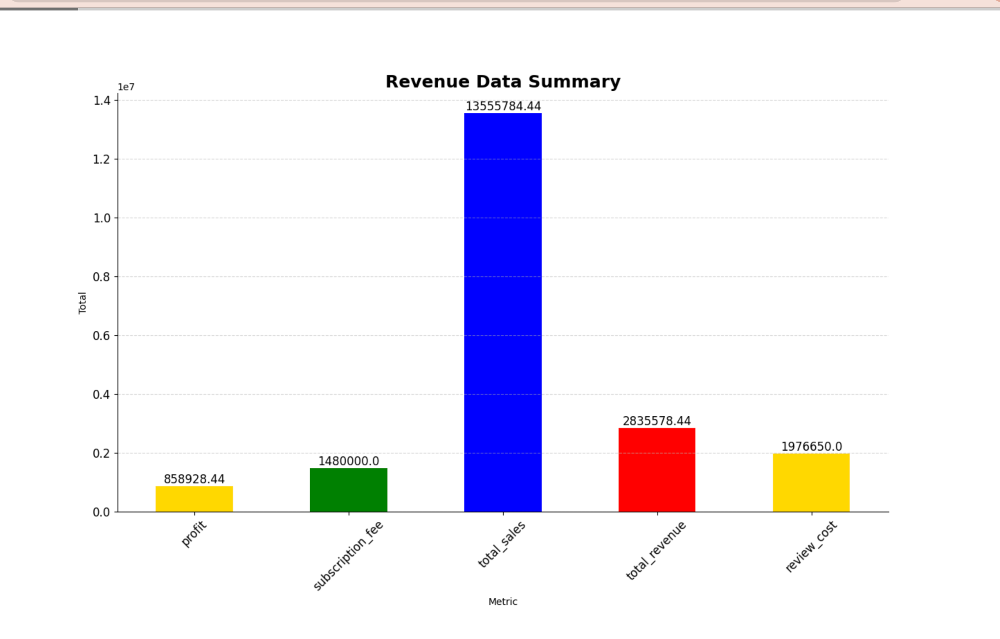
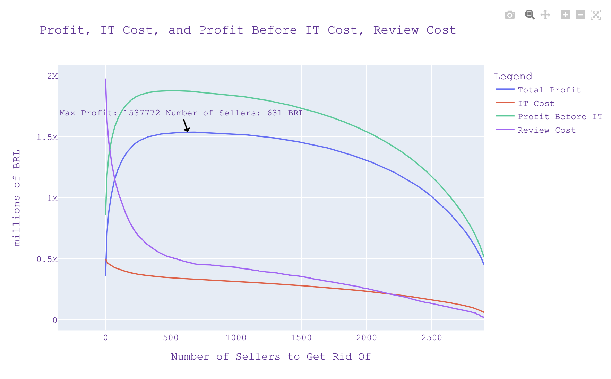
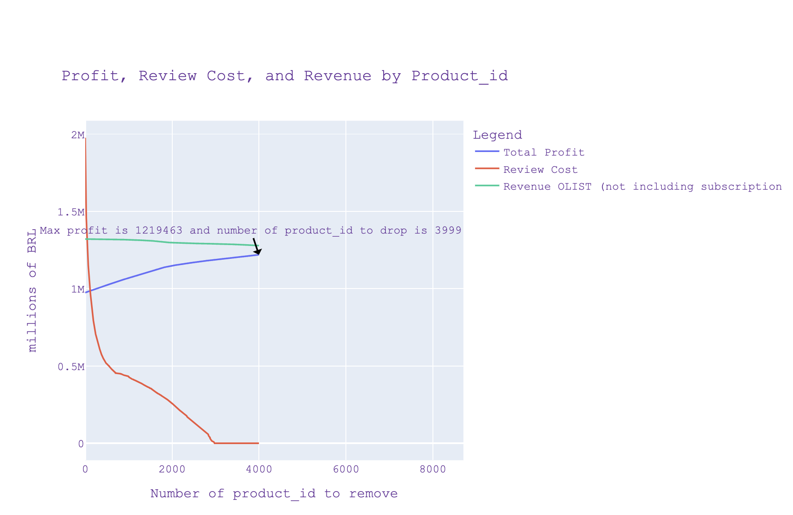

# Olist_ecommerce

1  CEO-Request Challenge
1.1  1. Summary of Problem Statement
❓ How could Olist improve its profit ❓?

Data is from https://www.kaggle.com/datasets/olistbr/brazilian-ecommerce/data?select=olist_sellers_dataset.csv

1.1.1  P&L Rules
1.1.1.1  Revenues
Sales fees: Olist takes a 10% cut on the product price (excl. freight) of each order delivered
Subscription fees: Olist charges 80 BRL by month per seller

1.1.1.2  Costs
Reputation costs estimated per order with bad reviews (<= 3 stars)

💡 In the long term, bad customer experience has business implications: low repeat rate, immediate customer support cost, refunds or unfavorable word of mouth communication. We will assume that we have an estimate measure of the monetary cost for each bad review:

# review_score: cost(BRL)
{'1 star': 100
'2 stars': 50
'3 stars': 40
'4 stars': 0
'5 stars': 0}
IT costs: Olist's total cumulated IT Costs scale with the square root of the total number of sellers that has ever join the platform, as well as the square root of the total cumulated number of items that were ever sold.

𝐼𝑇_𝑐𝑜𝑠𝑡𝑠=𝛼∗𝑛_𝑠𝑒𝑙𝑙𝑒𝑟𝑠⎯⎯⎯⎯⎯⎯⎯⎯⎯⎯⎯⎯⎯⎯⎯√+𝛽∗𝑛_𝑖𝑡𝑒𝑚𝑠⎯⎯⎯⎯⎯⎯⎯⎯⎯⎯⎯⎯√

Olist's data team gave us the following values for these scaling parameters:

𝛼=3157.27
𝛽=978.23
💡 Both number of sellers to manage and sales transaction are costly for IT systems.
💡 Yet square roots reflect scale-effects: IT-system are often more efficient as they grow bigger.
💡 Alpha > Beta means that Olist has a lower IT Cost with few sellers selling a lot of items rather than the opposite

with 1000 sellers and a total of 100 items sold, the total IT cost accumulates to 109,624 BRL
with 100 sellers and a total of 1000 items sold, the total IT cost accumulates to 62,507 BRL
Finally, The IT department also told you that since the birth of the marketplace, cumulated IT costs have amounted to 500,000 BRL.

1.1.2  Key Findings, so far
wait_time is the most significant factor behind low review scores
wait_time is made up of seller's delay_to_carrier + carrier_delivery_time.
The latter being outside of Olist's direct control, improving it is not a quick-win recommendation
On the contrary, a better selection of sellers can positively impact the delay_to_carrier and reduce the number of bad review_scores on Olist.
Comments of the bad reviews showed that some were linked to the seller or to the product itself.
💡sis instead with part 3

1.2  2. Should Olist remove under-performing sellers from its marketplace? 🕵🏻

We have  found the Total Sales and reputation costs for Olist, as we can see it is very high:

So, yes it could be logical to decrease  the number of underperforming sellers.

If the number of sellers to decrease is  631, it will maximize our profit.

However is it only way to improve Olist profit?

Another way could be to decrease the number underperforming bad products (product_id).

So, we could remove the number of products that give higher review costs so reducing it could save us the sellers.
By getting rid of 3000 bad performing product id, our number of sellers will be 2843
Overall number of sellers were around 3095.

So, instead of entirely removing sellers from Olists, we should focus on removing the specific products that receive bad review scores, rather than removing the entire seller. This approach allows us to retain good sellers who may excel at certain product categories, while addressing the problematic products that are driving up review costs and losses.
